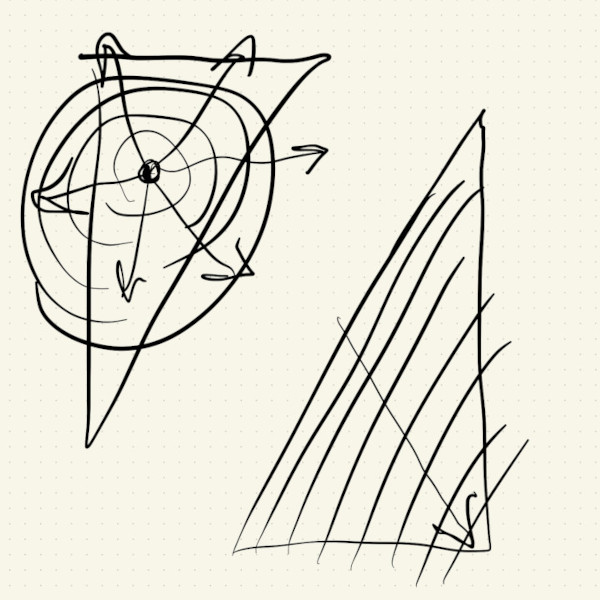

# 6063D 2023F Mid Term Project

## Milestone 3

This week I finished the logic necessary to implement the continuously changing cover.

A color change period is triggered every time the top-left half of the page gets a click, or automatically after a minute of inactivity.

The top-left color change happens in a radial wave pattern, while the bottom-right change follows a linear wave.

The radial wave is easy to compute using p5js's ```dist()``` function.

For the linear wave, I used the distance formula in the trigonometry [tutorial]():


$$d = \frac{\left|mX - nY + bn\right|}{\sqrt{m^2 + n^2}}$$

This was the most challenging task: figuring out the logic for making the colors change from black/white to a different color and then back to black/white.

I don't think the logic to detect whether the squares are ready to change, are changing, or need to change back is the most efficient, but it works and it was implemented with some of the JavaScript Array functions, like ```filter()``` and ```reduce()```, so they're not hard to understand.

Another aspect I'm not too happy about is that I ended up adding a whole lot of member variables to my class, like: distance threshold velocity, color change velocity, and lots of color variables.

I also picked the colors and fonts for the cover. These were based on some of the actual book's cover designs:


The blue colors have to do with the cold, ice and snow moments in the book. I didn't like when these non-black/white colors were on the whole cover because it made it look flat. I added a little bit of alpha to give some shading, depth, gradient to those colors.

The font is a kind of futuristic font from the 1960s or 1970s.

My presentation slides are [here](./assets/presentation_hersan.pdf).

---
## Milestone 2

This week I added the structure and pseudo-code to my project. I also added some shapes and temporary animations.

The design is gonna be a bunch of squares in a grid, split diagonally. Each of the two halves represents a nation in the planet *Gethen*, and each square is a *Gethenian*.

The left side of the canvas will respond to clicks, which will trigger a color change on both halves. The color change will also work on a timer, so if there are no interactions for one minute, it will also be triggered automatically, but start on the other half, on the right.

There will be two types of update waves: if triggered by a click, the update wave will proceed radially from the location of the click, otherwise the change will start on the other side and proceed from the center division line and proceed out.



I'm still not sure how the transition will go from one side to the other... I think once the radial wave reaches the division, that could trigger the linear wave... but I'm not sure about the other way.

The first challenge I plan to work on next week is the code that calculates the distance from a point to a line. This will be needed in the linear wave update. The radial wave is pretty easy, because the distance between two points is just: $$d = \sqrt{(x_1 - x_0)^2 + (y_1 - y_0)^2}$$

I didn't spend too much time on this yet, but considered a method where I would rotate the canvas and transform the distance function into just the x-distance. I don't think this would work because drawing on the tilted canvas would be hard.

 ❌

After reading about this calculation, I learned that the shortest distance from a point to a line is along a second line that is perpendicular to original line:


I worked out the math that will be needed, but I haven't implemented it yet. I can use vectors to do some dot-product projections and work out the distance from a point to a line geometrically.

My focus was on getting the background, the characters and the overall structure of the logic and class.


The design is looking like this:


I didn't want to think about color yet, so I tested some of the update logic in my class using rotation. While testing this logic, I accidentally created some wave patterns using a ```cos()``` function to pick different angle velocities for each square. This is quite nice, and is related to the theme of mutual influence between the people in *Gethen*, but I probably won't use it in the end because it might distract or interfere with the color changes. Or maybe this can happen just for some seconds as the color change starts, or stops.

I just realized that my cover kind of looks like the [Yin-Yang](https://en.wikipedia.org/wiki/Yin_and_yang) [Taijitu](https://en.wikipedia.org/wiki/Taijitu). This was totally an accident, but it connects to some of the dualistic themes of the book, including *Handdara*, the Taoistic religion in the *Karhide* nation.

---
## Milestone 1

### What book did you choose? What is it about?
The Left Hand of Darkness, by Ursula K. Le Guin. The book is about shifting political and personal loyalties between two nations and their citizens in a fictitious planet called Gethen.

Individuals on Gethen are ambisexual, with no fixed sex; instead they go into a period of fertility once a month where masculine or feminine traits are expressed temporarily. Relationships in Gethen are also dictated by *shifgrethor*, an intricate set of unspoken social rules and formal courtesy.

The story is told from the perspective of a visitor who doesn't fully understand all of these differences and how they influence society and politics on Gethen.

### What aspect of the book will you include in your cover?
The book explores themes of belonging and understanding through the rigidity and permeability of different dichotomies. 

The fluid sexuality and lack of gendered expectations are seen as the reason for greater equilibrium, justice and peacefulness on the planet, but, since the two nations have different political structures and social organization, those differences and misunderstood *shifgrethor* eventually cause them to go to war with each other. It's like some differences are understandable and respected, while others are not. Throughout the book, the main character's behavior also shifts away from rigidly rationalistic to be more patient and caring.

### Is it interactive? time-based? both?
Time-based.

### What ideas would you like to explore or experiment with?
Classes to create objects that represent the population of the two nations. These will change according to time and what other objects are near them.

I will probably use a design that has a diagonal division, and some shapes that are in grids, but jittery. Changes that start with one individual will propagate through all the other individuals of a nation, and each nation has its own way of propagating change.

#### Some sketches:


### Are there aspects of your project that are related to any of the readings we’ve done?
Can't think of any right now.
